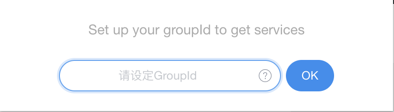
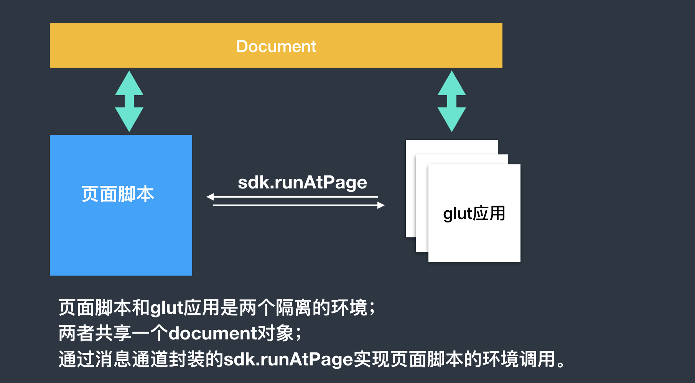
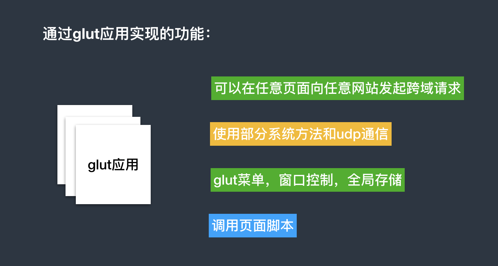
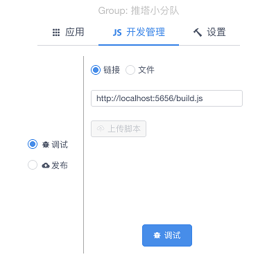
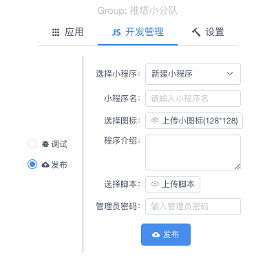
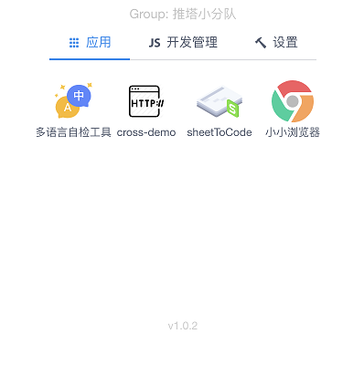
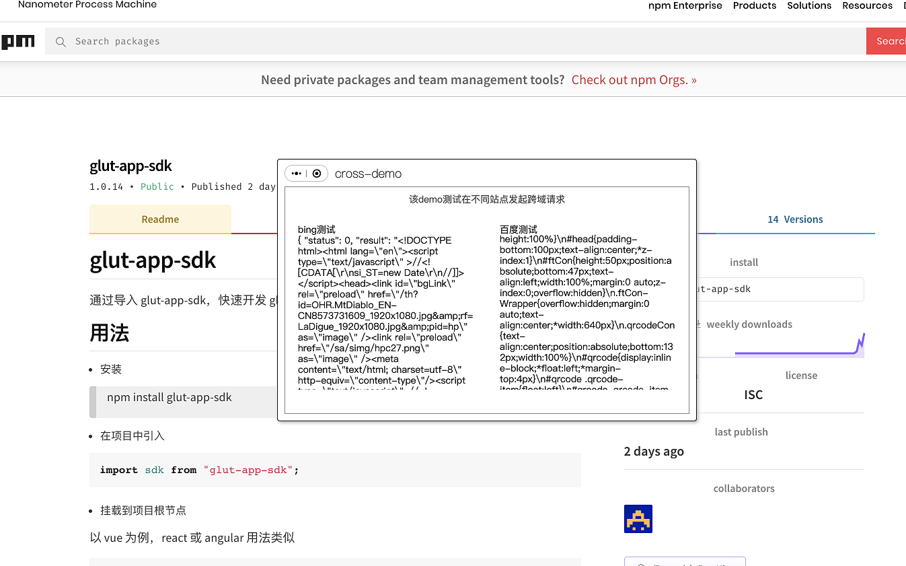
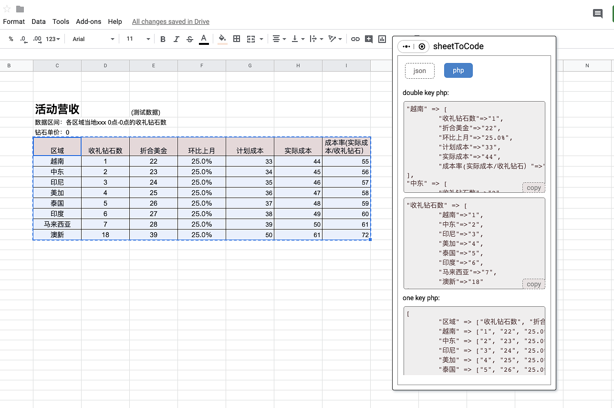
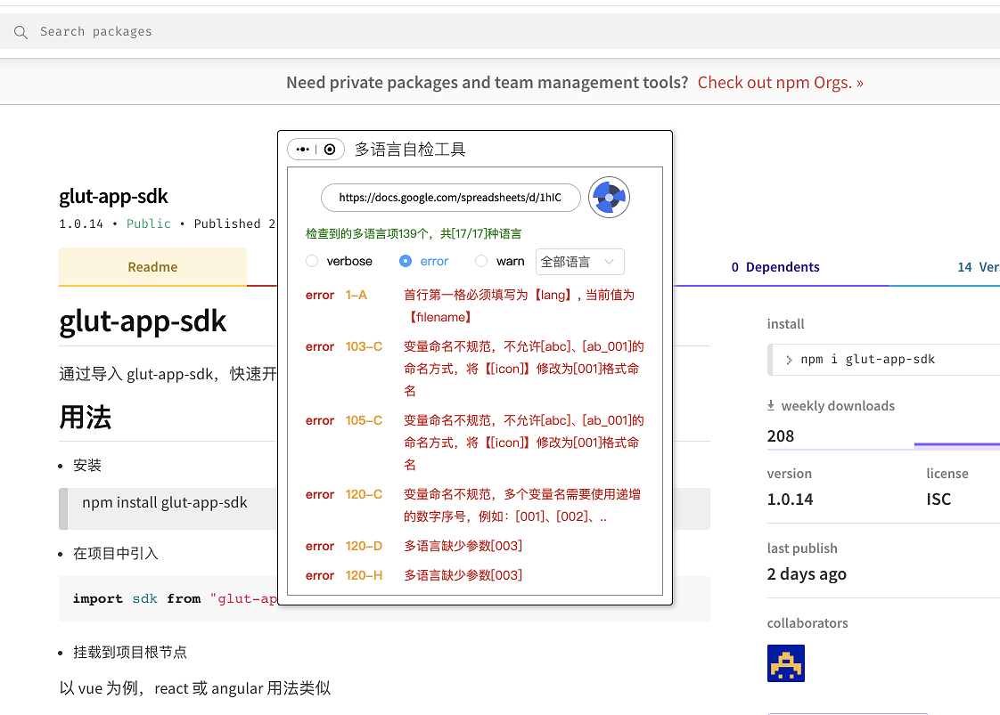
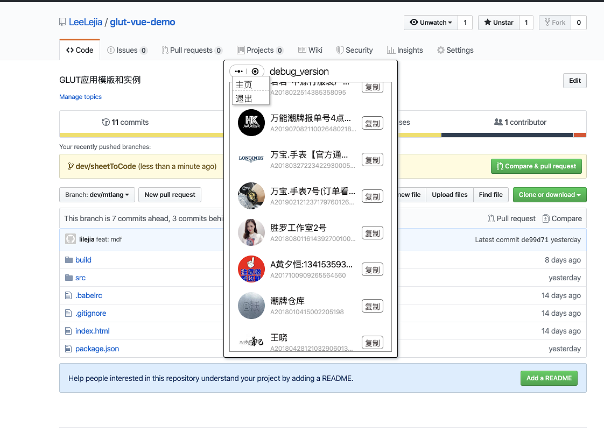

# Glut

一款用于团队内部工具开发共享的工具。

该项目旨在方便的进行 chrome 拓展应用开发和分享。相当于一套运行在 chrome 上的小程序框架，它提供了比页面脚本更多的 Api。

## 安装

- 从[chromeWebStore](https://chrome.google.com/webstore/detail/glut/baggadcfggenanhadoapjamongmhjpla)安装

> 启动应用的时候要求输入一个 groupId



- 使用邮箱申请 `GroupId`

  > [点击申请链接](https://leelejia.github.io/sites/glut?page=regiest)

- 查看 `GroupId`

  > [点击查看 GroupId](https://leelejia.github.io/sites/glut?page=regiest)

- 可以尝试使用下面的 groupId 进行开发调试体验，但发布需要你独立申请一个 groupId
  > GroupId: <span style="color: darkorange">5dc0eeb3d1b85c00086c4a42</span>

## Glut 应用开发

> glut 应用是一个可以随时在页面打开的小组件，它既可以作为页面的辅助工具或者也可以提供独立的功能。如果你使用过*Tampermonkey*,你会发现 glut 提供了更强大的功能。

glut 应用的开发不限制前端框架，在项目中引入 sdk，可以在本地开发调试完成后将应用上传。同一个 groupId 的其它人即可同步到更新。

- glut 应用和页面脚本



- 可以通过 glut 应用实现的功能



### 开发步骤

<!-- 新建项目 -->

<details>
  <summary>新建项目</summary>

> 配置你的前端项目,并确保最终项目被打包为一个文件。  
> 或者直接使用 [vue 开发模版](https://github.com/LeeLejia/glut-vue-demo),目前仅提供 vue 模版,你可以稍作配置进行 react 或者 angular 项目开发。 [vue-typescript 开发模版](https://github.com/LeeLejia/glut-vue-demo/tree/typescript-demo)

- 安装 sdk

  [sdk API 文档](glut-app-sdk/README.md)

  ```bash
  npm install glut-app-sdk
  ```

- 在项目中引入

  ```javascript
  import sdk from "glut-app-sdk";
  ```

  </details>

<!-- 调试 -->

<details>
  <summary>调试</summary>

在面板中选择调试,输入打包后的 js 链接或者文件。  
 在[vue 开发模版](https://github.com/LeeLejia/glut-vue-demo)中，你可以先执行

```bash
npm install
npm run dev
```

然后调试链接设置：http://localhost:5656/build.js  
 点击调试运行应用



  </details>

<!-- 发布 -->

<details>
  <summary>发布</summary>

> 调试功能正常之后，选择发布->新建小程序,提供小程序信息和发布密码，点击发布。



> 发布成功后相同 groupId 的成员在下一次打开浏览器时将同步到更新，也可以通过*设置->同步配置*及时获得更新。



  </details>

<!-- demo -->

## DEMO

<details>

<summary>cross-example</summary>

[项目仓库](https://github.com/LeeLejia/glut-vue-demo/tree/dev/cross-example)

> 在 npm 向 bing 和百度发起请求



</details>

<details>

<summary>sheetToCode</summary>

[项目仓库](https://github.com/LeeLejia/glut-vue-demo/tree/dev/sheetToCode)

> 复制表格生成代码



</details>

<details>

<summary>多语言自检工具</summary>

[项目仓库](https://github.com/LeeLejia/glut-vue-demo/tree/dev/mtlang)

> 基于跨域接口的，文档链接格式检查应用



</details>

<details>
<summary>微商小工具</summary>

> 一个自动转发店铺商品的小应用



</details>

## Glut 小程序调试发布流程

<iframe height=498 width=510 src='http://player.youku.com/embed/XNDQ2NTU0NjgyOA==' frameborder=0 'allowfullscreen'>调试发布</iframe>
